# In this project we will be working advertising data set, indicating whether or not a particular internet user clicked on an Advertisement on a company website. We will try to create a model that will predict whether or not they will click on an ad based off the features of that user.
This data set contains the following features:
* 'Daily Time Spent on Site': consumer time on site in minutes
* 'Age': cutomer age in years
* 'Area Income': Avg. Income of geographical area of consumer
* 'Daily Internet Usage': Avg. minutes a day consumer is on the internet
* 'Ad Topic Line': Headline of the advertisement
* 'City': City of consumer
* 'Male': Whether or not consumer was male
* 'Country': Country of consumer
* 'Timestamp': Time at which consumer clicked on Ad or closed window
* 'Clicked on Ad': 0 or 1 indicated clicking on Ad


```python
import pandas as pd
import numpy as np
import matplotlib.pyplot as plt
import seaborn as sns
%matplotlib inline
```


```python
adv_df = pd.read_csv('advertising.csv')
```


```python
adv_df.head()
```


<div>
<style scoped>
    .dataframe tbody tr th:only-of-type {
        vertical-align: middle;
    }

    .dataframe tbody tr th {
        vertical-align: top;
    }

    .dataframe thead th {
        text-align: right;
    }
</style>
<table border="1" class="dataframe">
  <thead>
    <tr style="text-align: right;">
      <th></th>
      <th>Daily Time Spent on Site</th>
      <th>Age</th>
      <th>Area Income</th>
      <th>Daily Internet Usage</th>
      <th>Ad Topic Line</th>
      <th>City</th>
      <th>Male</th>
      <th>Country</th>
      <th>Timestamp</th>
      <th>Clicked on Ad</th>
    </tr>
  </thead>
  <tbody>
    <tr>
      <th>0</th>
      <td>68.95</td>
      <td>35</td>
      <td>61833.90</td>
      <td>256.09</td>
      <td>Cloned 5thgeneration orchestration</td>
      <td>Wrightburgh</td>
      <td>0</td>
      <td>Tunisia</td>
      <td>2016-03-27 00:53:11</td>
      <td>0</td>
    </tr>
    <tr>
      <th>1</th>
      <td>80.23</td>
      <td>31</td>
      <td>68441.85</td>
      <td>193.77</td>
      <td>Monitored national standardization</td>
      <td>West Jodi</td>
      <td>1</td>
      <td>Nauru</td>
      <td>2016-04-04 01:39:02</td>
      <td>0</td>
    </tr>
    <tr>
      <th>2</th>
      <td>69.47</td>
      <td>26</td>
      <td>59785.94</td>
      <td>236.50</td>
      <td>Organic bottom-line service-desk</td>
      <td>Davidton</td>
      <td>0</td>
      <td>San Marino</td>
      <td>2016-03-13 20:35:42</td>
      <td>0</td>
    </tr>
    <tr>
      <th>3</th>
      <td>74.15</td>
      <td>29</td>
      <td>54806.18</td>
      <td>245.89</td>
      <td>Triple-buffered reciprocal time-frame</td>
      <td>West Terrifurt</td>
      <td>1</td>
      <td>Italy</td>
      <td>2016-01-10 02:31:19</td>
      <td>0</td>
    </tr>
    <tr>
      <th>4</th>
      <td>68.37</td>
      <td>35</td>
      <td>73889.99</td>
      <td>225.58</td>
      <td>Robust logistical utilization</td>
      <td>South Manuel</td>
      <td>0</td>
      <td>Iceland</td>
      <td>2016-06-03 03:36:18</td>
      <td>0</td>
    </tr>
  </tbody>
</table>
</div>


```python
adv_df.info()
```

    <class 'pandas.core.frame.DataFrame'>
    RangeIndex: 1000 entries, 0 to 999
    Data columns (total 10 columns):
    Daily Time Spent on Site    1000 non-null float64
    Age                         1000 non-null int64
    Area Income                 1000 non-null float64
    Daily Internet Usage        1000 non-null float64
    Ad Topic Line               1000 non-null object
    City                        1000 non-null object
    Male                        1000 non-null int64
    Country                     1000 non-null object
    Timestamp                   1000 non-null object
    Clicked on Ad               1000 non-null int64
    dtypes: float64(3), int64(3), object(4)
    memory usage: 78.2+ KB


```python
adv_df.describe()
```


<div>
<style scoped>
    .dataframe tbody tr th:only-of-type {
        vertical-align: middle;
    }

    .dataframe tbody tr th {
        vertical-align: top;
    }

    .dataframe thead th {
        text-align: right;
    }
</style>
<table border="1" class="dataframe">
  <thead>
    <tr style="text-align: right;">
      <th></th>
      <th>Daily Time Spent on Site</th>
      <th>Age</th>
      <th>Area Income</th>
      <th>Daily Internet Usage</th>
      <th>Male</th>
      <th>Clicked on Ad</th>
    </tr>
  </thead>
  <tbody>
    <tr>
      <th>count</th>
      <td>1000.000000</td>
      <td>1000.000000</td>
      <td>1000.000000</td>
      <td>1000.000000</td>
      <td>1000.000000</td>
      <td>1000.00000</td>
    </tr>
    <tr>
      <th>mean</th>
      <td>65.000200</td>
      <td>36.009000</td>
      <td>55000.000080</td>
      <td>180.000100</td>
      <td>0.481000</td>
      <td>0.50000</td>
    </tr>
    <tr>
      <th>std</th>
      <td>15.853615</td>
      <td>8.785562</td>
      <td>13414.634022</td>
      <td>43.902339</td>
      <td>0.499889</td>
      <td>0.50025</td>
    </tr>
    <tr>
      <th>min</th>
      <td>32.600000</td>
      <td>19.000000</td>
      <td>13996.500000</td>
      <td>104.780000</td>
      <td>0.000000</td>
      <td>0.00000</td>
    </tr>
    <tr>
      <th>25%</th>
      <td>51.360000</td>
      <td>29.000000</td>
      <td>47031.802500</td>
      <td>138.830000</td>
      <td>0.000000</td>
      <td>0.00000</td>
    </tr>
    <tr>
      <th>50%</th>
      <td>68.215000</td>
      <td>35.000000</td>
      <td>57012.300000</td>
      <td>183.130000</td>
      <td>0.000000</td>
      <td>0.50000</td>
    </tr>
    <tr>
      <th>75%</th>
      <td>78.547500</td>
      <td>42.000000</td>
      <td>65470.635000</td>
      <td>218.792500</td>
      <td>1.000000</td>
      <td>1.00000</td>
    </tr>
    <tr>
      <th>max</th>
      <td>91.430000</td>
      <td>61.000000</td>
      <td>79484.800000</td>
      <td>269.960000</td>
      <td>1.000000</td>
      <td>1.00000</td>
    </tr>
  </tbody>
</table>
</div>


```python
df=adv_df
```

# Reading Timestamp and splitting it into Date and time columns


```python
df['Date'] = pd.to_datetime(df['Timestamp']).dt.date
df['Time'] = pd.to_datetime(df['Timestamp']).dt.time
```


```python
df.head(5)
```


<div>
<style scoped>
    .dataframe tbody tr th:only-of-type {
        vertical-align: middle;
    }

    .dataframe tbody tr th {
        vertical-align: top;
    }

    .dataframe thead th {
        text-align: right;
    }
</style>
<table border="1" class="dataframe">
  <thead>
    <tr style="text-align: right;">
      <th></th>
      <th>Daily Time Spent on Site</th>
      <th>Age</th>
      <th>Area Income</th>
      <th>Daily Internet Usage</th>
      <th>Ad Topic Line</th>
      <th>City</th>
      <th>Male</th>
      <th>Country</th>
      <th>Timestamp</th>
      <th>Clicked on Ad</th>
      <th>Date</th>
      <th>Time</th>
    </tr>
  </thead>
  <tbody>
    <tr>
      <th>0</th>
      <td>68.95</td>
      <td>35</td>
      <td>61833.90</td>
      <td>256.09</td>
      <td>Cloned 5thgeneration orchestration</td>
      <td>Wrightburgh</td>
      <td>0</td>
      <td>Tunisia</td>
      <td>2016-03-27 00:53:11</td>
      <td>0</td>
      <td>2016-03-27</td>
      <td>00:53:11</td>
    </tr>
    <tr>
      <th>1</th>
      <td>80.23</td>
      <td>31</td>
      <td>68441.85</td>
      <td>193.77</td>
      <td>Monitored national standardization</td>
      <td>West Jodi</td>
      <td>1</td>
      <td>Nauru</td>
      <td>2016-04-04 01:39:02</td>
      <td>0</td>
      <td>2016-04-04</td>
      <td>01:39:02</td>
    </tr>
    <tr>
      <th>2</th>
      <td>69.47</td>
      <td>26</td>
      <td>59785.94</td>
      <td>236.50</td>
      <td>Organic bottom-line service-desk</td>
      <td>Davidton</td>
      <td>0</td>
      <td>San Marino</td>
      <td>2016-03-13 20:35:42</td>
      <td>0</td>
      <td>2016-03-13</td>
      <td>20:35:42</td>
    </tr>
    <tr>
      <th>3</th>
      <td>74.15</td>
      <td>29</td>
      <td>54806.18</td>
      <td>245.89</td>
      <td>Triple-buffered reciprocal time-frame</td>
      <td>West Terrifurt</td>
      <td>1</td>
      <td>Italy</td>
      <td>2016-01-10 02:31:19</td>
      <td>0</td>
      <td>2016-01-10</td>
      <td>02:31:19</td>
    </tr>
    <tr>
      <th>4</th>
      <td>68.37</td>
      <td>35</td>
      <td>73889.99</td>
      <td>225.58</td>
      <td>Robust logistical utilization</td>
      <td>South Manuel</td>
      <td>0</td>
      <td>Iceland</td>
      <td>2016-06-03 03:36:18</td>
      <td>0</td>
      <td>2016-06-03</td>
      <td>03:36:18</td>
    </tr>
  </tbody>
</table>
</div>


# Splitting Date column into further date , month and year


```python
df['Year'] = pd.DatetimeIndex(df['Date']).year
df['Month'] = pd.DatetimeIndex(df['Date']).month
df['Date'] = pd.DatetimeIndex(df['Date']).day
df['year_month'] = pd.to_datetime(df['Date']).dt.to_period('M')
df=df.drop(columns=['Ad Topic Line','City','Country','Timestamp','Time','year_month'])
```


```python
df.head(5)
```


<div>
<style scoped>
    .dataframe tbody tr th:only-of-type {
        vertical-align: middle;
    }

    .dataframe tbody tr th {
        vertical-align: top;
    }

    .dataframe thead th {
        text-align: right;
    }
</style>
<table border="1" class="dataframe">
  <thead>
    <tr style="text-align: right;">
      <th></th>
      <th>Daily Time Spent on Site</th>
      <th>Age</th>
      <th>Area Income</th>
      <th>Daily Internet Usage</th>
      <th>Male</th>
      <th>Clicked on Ad</th>
      <th>Date</th>
      <th>Year</th>
      <th>Month</th>
    </tr>
  </thead>
  <tbody>
    <tr>
      <th>0</th>
      <td>68.95</td>
      <td>35</td>
      <td>61833.90</td>
      <td>256.09</td>
      <td>0</td>
      <td>0</td>
      <td>27</td>
      <td>2016</td>
      <td>3</td>
    </tr>
    <tr>
      <th>1</th>
      <td>80.23</td>
      <td>31</td>
      <td>68441.85</td>
      <td>193.77</td>
      <td>1</td>
      <td>0</td>
      <td>4</td>
      <td>2016</td>
      <td>4</td>
    </tr>
    <tr>
      <th>2</th>
      <td>69.47</td>
      <td>26</td>
      <td>59785.94</td>
      <td>236.50</td>
      <td>0</td>
      <td>0</td>
      <td>13</td>
      <td>2016</td>
      <td>3</td>
    </tr>
    <tr>
      <th>3</th>
      <td>74.15</td>
      <td>29</td>
      <td>54806.18</td>
      <td>245.89</td>
      <td>1</td>
      <td>0</td>
      <td>10</td>
      <td>2016</td>
      <td>1</td>
    </tr>
    <tr>
      <th>4</th>
      <td>68.37</td>
      <td>35</td>
      <td>73889.99</td>
      <td>225.58</td>
      <td>0</td>
      <td>0</td>
      <td>3</td>
      <td>2016</td>
      <td>6</td>
    </tr>
  </tbody>
</table>
</div>


```python
adv_df.head(5)
```


<div>
<style scoped>
    .dataframe tbody tr th:only-of-type {
        vertical-align: middle;
    }

    .dataframe tbody tr th {
        vertical-align: top;
    }

    .dataframe thead th {
        text-align: right;
    }
</style>
<table border="1" class="dataframe">
  <thead>
    <tr style="text-align: right;">
      <th></th>
      <th>Daily Time Spent on Site</th>
      <th>Age</th>
      <th>Area Income</th>
      <th>Daily Internet Usage</th>
      <th>Ad Topic Line</th>
      <th>City</th>
      <th>Male</th>
      <th>Country</th>
      <th>Timestamp</th>
      <th>Clicked on Ad</th>
      <th>Date</th>
      <th>Time</th>
      <th>Year</th>
      <th>Month</th>
      <th>year_month</th>
    </tr>
  </thead>
  <tbody>
    <tr>
      <th>0</th>
      <td>68.95</td>
      <td>35</td>
      <td>61833.90</td>
      <td>256.09</td>
      <td>Cloned 5thgeneration orchestration</td>
      <td>Wrightburgh</td>
      <td>0</td>
      <td>Tunisia</td>
      <td>2016-03-27 00:53:11</td>
      <td>0</td>
      <td>27</td>
      <td>00:53:11</td>
      <td>2016</td>
      <td>3</td>
      <td>1970-01</td>
    </tr>
    <tr>
      <th>1</th>
      <td>80.23</td>
      <td>31</td>
      <td>68441.85</td>
      <td>193.77</td>
      <td>Monitored national standardization</td>
      <td>West Jodi</td>
      <td>1</td>
      <td>Nauru</td>
      <td>2016-04-04 01:39:02</td>
      <td>0</td>
      <td>4</td>
      <td>01:39:02</td>
      <td>2016</td>
      <td>4</td>
      <td>1970-01</td>
    </tr>
    <tr>
      <th>2</th>
      <td>69.47</td>
      <td>26</td>
      <td>59785.94</td>
      <td>236.50</td>
      <td>Organic bottom-line service-desk</td>
      <td>Davidton</td>
      <td>0</td>
      <td>San Marino</td>
      <td>2016-03-13 20:35:42</td>
      <td>0</td>
      <td>13</td>
      <td>20:35:42</td>
      <td>2016</td>
      <td>3</td>
      <td>1970-01</td>
    </tr>
    <tr>
      <th>3</th>
      <td>74.15</td>
      <td>29</td>
      <td>54806.18</td>
      <td>245.89</td>
      <td>Triple-buffered reciprocal time-frame</td>
      <td>West Terrifurt</td>
      <td>1</td>
      <td>Italy</td>
      <td>2016-01-10 02:31:19</td>
      <td>0</td>
      <td>10</td>
      <td>02:31:19</td>
      <td>2016</td>
      <td>1</td>
      <td>1970-01</td>
    </tr>
    <tr>
      <th>4</th>
      <td>68.37</td>
      <td>35</td>
      <td>73889.99</td>
      <td>225.58</td>
      <td>Robust logistical utilization</td>
      <td>South Manuel</td>
      <td>0</td>
      <td>Iceland</td>
      <td>2016-06-03 03:36:18</td>
      <td>0</td>
      <td>3</td>
      <td>03:36:18</td>
      <td>2016</td>
      <td>6</td>
      <td>1970-01</td>
    </tr>
  </tbody>
</table>
</div>


# Exploratory Data Analysis
Here using seaborn to explore the data!


# Insight 1 : Potting Histogram with respect to Age , we can see that majority of the people are between 27 to 42 years


```python
sns.set_style('whitegrid')
adv_df['Age'].hist(bins=40)
plt.xlabel('Age')
```


    Text(0.5,0,'Age')


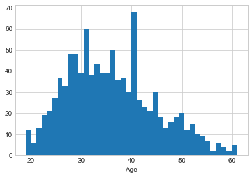


```python
adv_df.info()
```

    <class 'pandas.core.frame.DataFrame'>
    RangeIndex: 1000 entries, 0 to 999
    Data columns (total 15 columns):
    Daily Time Spent on Site    1000 non-null float64
    Age                         1000 non-null int64
    Area Income                 1000 non-null float64
    Daily Internet Usage        1000 non-null float64
    Ad Topic Line               1000 non-null object
    City                        1000 non-null object
    Male                        1000 non-null int64
    Country                     1000 non-null object
    Timestamp                   1000 non-null object
    Clicked on Ad               1000 non-null int64
    Date                        1000 non-null int64
    Time                        1000 non-null object
    Year                        1000 non-null int64
    Month                       1000 non-null int64
    year_month                  1000 non-null object
    dtypes: float64(3), int64(6), object(6)
    memory usage: 117.3+ KB


# Jointplot showing the kde distributions of 'Daily Time spent on site' vs 'Age'

# Insight 2 : Users who are around the age of 30 yrs are spending maximum amount of time on site .i.e. around 80


```python
sns.jointplot(x='Age',y='Daily Time Spent on Site',data=adv_df,color='red',kind='kde');
```


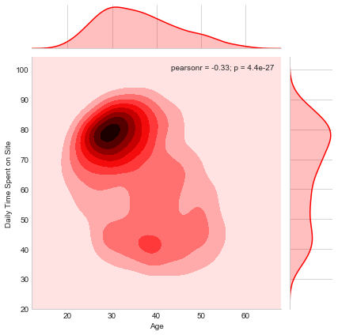


# Jointplot of 'Daily Time Spent on Site' vs. 'Daily Internet Usage'

# Insight 3: Here we can see that users who are spending maximum of time on site are also approximatly same set of users who are having highest internet usage.


```python
sns.jointplot(x='Daily Time Spent on Site',y='Daily Internet Usage',data=adv_df,color='green')
```


    <seaborn.axisgrid.JointGrid at 0x1123baf98>


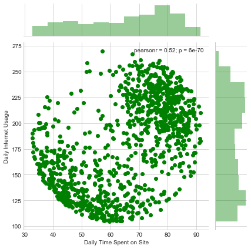


```python
adv_df.head(5)
```


<div>
<style scoped>
    .dataframe tbody tr th:only-of-type {
        vertical-align: middle;
    }

    .dataframe tbody tr th {
        vertical-align: top;
    }

    .dataframe thead th {
        text-align: right;
    }
</style>
<table border="1" class="dataframe">
  <thead>
    <tr style="text-align: right;">
      <th></th>
      <th>Daily Time Spent on Site</th>
      <th>Age</th>
      <th>Area Income</th>
      <th>Daily Internet Usage</th>
      <th>Ad Topic Line</th>
      <th>City</th>
      <th>Male</th>
      <th>Country</th>
      <th>Timestamp</th>
      <th>Clicked on Ad</th>
      <th>Date</th>
      <th>Time</th>
      <th>Year</th>
      <th>Month</th>
      <th>year_month</th>
    </tr>
  </thead>
  <tbody>
    <tr>
      <th>0</th>
      <td>68.95</td>
      <td>35</td>
      <td>61833.90</td>
      <td>256.09</td>
      <td>Cloned 5thgeneration orchestration</td>
      <td>Wrightburgh</td>
      <td>0</td>
      <td>Tunisia</td>
      <td>2016-03-27 00:53:11</td>
      <td>0</td>
      <td>27</td>
      <td>00:53:11</td>
      <td>2016</td>
      <td>3</td>
      <td>1970-01</td>
    </tr>
    <tr>
      <th>1</th>
      <td>80.23</td>
      <td>31</td>
      <td>68441.85</td>
      <td>193.77</td>
      <td>Monitored national standardization</td>
      <td>West Jodi</td>
      <td>1</td>
      <td>Nauru</td>
      <td>2016-04-04 01:39:02</td>
      <td>0</td>
      <td>4</td>
      <td>01:39:02</td>
      <td>2016</td>
      <td>4</td>
      <td>1970-01</td>
    </tr>
    <tr>
      <th>2</th>
      <td>69.47</td>
      <td>26</td>
      <td>59785.94</td>
      <td>236.50</td>
      <td>Organic bottom-line service-desk</td>
      <td>Davidton</td>
      <td>0</td>
      <td>San Marino</td>
      <td>2016-03-13 20:35:42</td>
      <td>0</td>
      <td>13</td>
      <td>20:35:42</td>
      <td>2016</td>
      <td>3</td>
      <td>1970-01</td>
    </tr>
    <tr>
      <th>3</th>
      <td>74.15</td>
      <td>29</td>
      <td>54806.18</td>
      <td>245.89</td>
      <td>Triple-buffered reciprocal time-frame</td>
      <td>West Terrifurt</td>
      <td>1</td>
      <td>Italy</td>
      <td>2016-01-10 02:31:19</td>
      <td>0</td>
      <td>10</td>
      <td>02:31:19</td>
      <td>2016</td>
      <td>1</td>
      <td>1970-01</td>
    </tr>
    <tr>
      <th>4</th>
      <td>68.37</td>
      <td>35</td>
      <td>73889.99</td>
      <td>225.58</td>
      <td>Robust logistical utilization</td>
      <td>South Manuel</td>
      <td>0</td>
      <td>Iceland</td>
      <td>2016-06-03 03:36:18</td>
      <td>0</td>
      <td>3</td>
      <td>03:36:18</td>
      <td>2016</td>
      <td>6</td>
      <td>1970-01</td>
    </tr>
  </tbody>
</table>
</div>


# Insight 4: Here majority of people above the age of 30 are more clicking on advertisement although there is small clusters of user in exception


```python
plt.figure(figsize=(10,6))
df[df['Clicked on Ad']==1]['Age'].hist(alpha=0.5,color='green',
                                              bins=40,label='Clicked on Ad=1')
df[df['Clicked on Ad']==0]['Age'].hist(alpha=0.5,color='red',
                                              bins=40,label='Clicked on Ad=0')
plt.legend()
plt.xlabel('Age')
```


    Text(0.5,0,'Age')


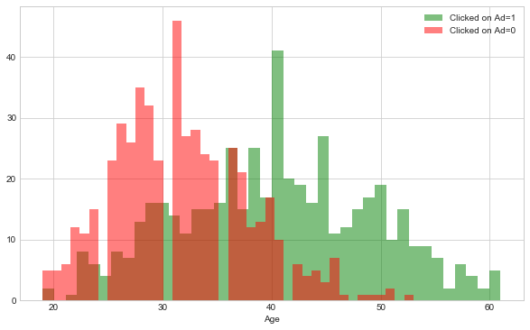


# Insight 5 : User who have Daily Internet Usage less than 200 units are more prone to Clicking on Advertisment


```python
plt.figure(figsize=(10,6))
df[df['Clicked on Ad']==1]['Daily Internet Usage'].hist(alpha=0.5,color='blue',
                                              bins=40,label='Clicked on Ad=1')
df[df['Clicked on Ad']==0]['Daily Internet Usage'].hist(alpha=0.5,color='red',
                                              bins=40,label='Clicked on Ad=0')
plt.legend()
plt.xlabel('Daily Internet Usage')
```


    Text(0.5,0,'Daily Internet Usage')


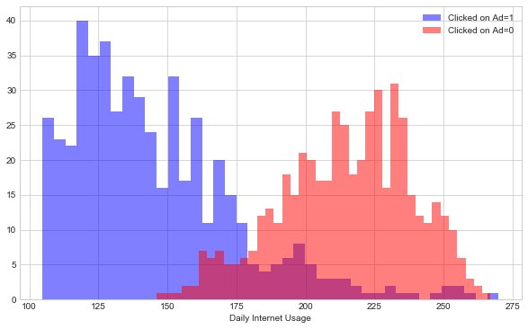


# Insight 6 : Joint Plot and Count Plot of Age with Clicked on Ad field. Here we can see that users who are around age of 30 years have high probability of not clicking on advertisement, whereas as the users age is increased we can see there is more interest in clicking advertisement.


```python
sns.jointplot(x='Age',y='Clicked on Ad',data=df,color='purple',kind='kde')
```


    <seaborn.axisgrid.JointGrid at 0x1182db438>


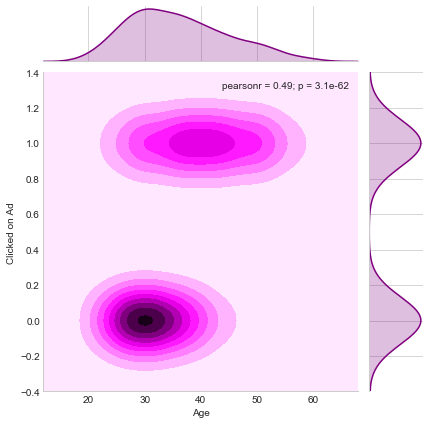


```python
plt.figure(figsize=(11,7))
sns.countplot(x='Age',hue='Clicked on Ad',data=df,palette='Set1')
```


    <matplotlib.axes._subplots.AxesSubplot at 0x1184bed30>


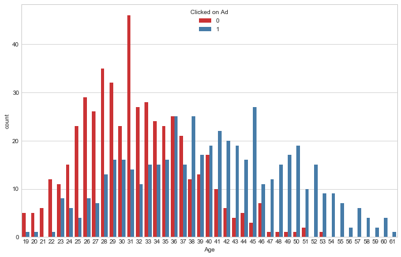


# Insight 7 : From below graphs we can see that there is high probability of clicking on the advertisment by Female than by a Male


```python
sns.countplot(x='Male',hue='Clicked on Ad',data=df)
```


    <matplotlib.axes._subplots.AxesSubplot at 0x119170d68>


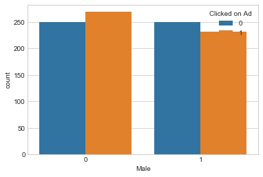


# Insight 8 : User with age of around 30 years are doing daily internet usage between 200 MB to 250 MB, whereas users between age of 35 to 45 years are having daily internet usage of 125MB


```python
sns.jointplot(x='Age',y='Daily Internet Usage',data=df,color='purple',kind='kde')
```


    <seaborn.axisgrid.JointGrid at 0x11912d390>


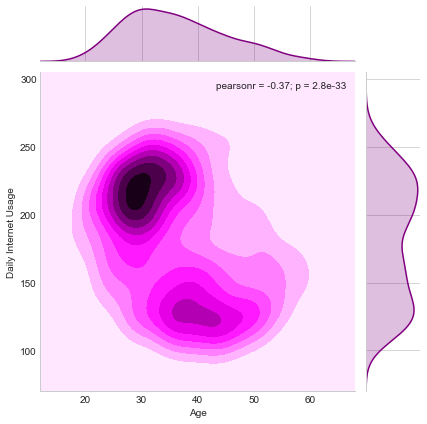


# Insight 9 : Majority of the users are around age of 30 in the category of area income which ranges between 60000USD to 70000 USD


```python
sns.jointplot(x='Age',y='Area Income',data=df,color='orange',kind='kde')
```


    <seaborn.axisgrid.JointGrid at 0x119159160>


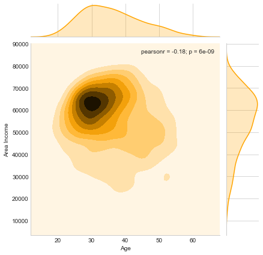


# Insight 9 : As per below trend differed between Gender and clicked on Ad.We can see that for Male or female who are having daily internet usage of around 150 units are more prone to click on an advertisement whereas as for users whose usage limit is more than 200 MB they are not interested in advertisements. This tells us that the user who is mostly clicking on advertisement is mostly doing internet browsing especially reading online articles and few online videos.


```python
plt.figure(figsize=(11,7))
sns.lmplot(y='Daily Internet Usage',x='Age',data=df,hue='Clicked on Ad',
           col='Male',palette='Set1')
```


    <seaborn.axisgrid.FacetGrid at 0x1a1d4e8588>


    <matplotlib.figure.Figure at 0x1a1d50e240>


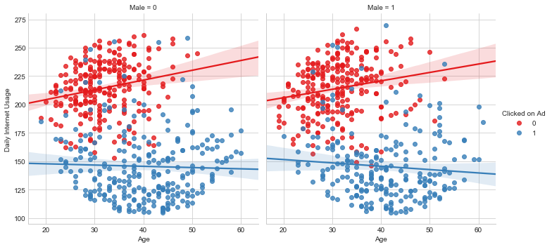


# Applying Machine Learning Model

# 1) Logistic Regression

Split the data into training set and testing set using train_test_split


```python
from sklearn.model_selection import train_test_split
```


```python
X = adv_df[['Daily Time Spent on Site', 'Age', 'Area Income','Daily Internet Usage', 'Male']]
y = adv_df['Clicked on Ad']
```


```python
X_train, X_test, y_train, y_test = train_test_split(X, y, test_size=0.3, random_state=42)
```

Train and fit a logistic regression model on the training set.


```python
from sklearn.linear_model import LogisticRegression
```


```python
logmodel = LogisticRegression()
logmodel.fit(X_train,y_train)
```


    LogisticRegression(C=1.0, class_weight=None, dual=False, fit_intercept=True,
              intercept_scaling=1, max_iter=100, multi_class='ovr', n_jobs=1,
              penalty='l2', random_state=None, solver='liblinear', tol=0.0001,
              verbose=0, warm_start=False)


# Predictions and Evaluations

Now predict values for the testing data.


```python
predictions = logmodel.predict(X_test)
```

Create a classification report for the model.


```python
from sklearn.metrics import classification_report,confusion_matrix
```


```python
print(classification_report(y_test,predictions))
```

                 precision    recall  f1-score   support
    
              0       0.84      0.97      0.90       146
              1       0.96      0.82      0.89       154
    
    avg / total       0.90      0.89      0.89       300
    


```python
print(confusion_matrix(y_test,predictions))
```

    [[141   5]
     [ 27 127]]


Here we can see that accuracy of above model is having precision of avg/total as 90%

# 2) Decision Tree


```python
df.info()
```

    <class 'pandas.core.frame.DataFrame'>
    RangeIndex: 1000 entries, 0 to 999
    Data columns (total 9 columns):
    Daily Time Spent on Site    1000 non-null float64
    Age                         1000 non-null int64
    Area Income                 1000 non-null float64
    Daily Internet Usage        1000 non-null float64
    Male                        1000 non-null int64
    Clicked on Ad               1000 non-null int64
    Date                        1000 non-null int64
    Year                        1000 non-null int64
    Month                       1000 non-null int64
    dtypes: float64(3), int64(6)
    memory usage: 70.4 KB


```python
df.head()
```


<div>
<style scoped>
    .dataframe tbody tr th:only-of-type {
        vertical-align: middle;
    }

    .dataframe tbody tr th {
        vertical-align: top;
    }

    .dataframe thead th {
        text-align: right;
    }
</style>
<table border="1" class="dataframe">
  <thead>
    <tr style="text-align: right;">
      <th></th>
      <th>Daily Time Spent on Site</th>
      <th>Age</th>
      <th>Area Income</th>
      <th>Daily Internet Usage</th>
      <th>Male</th>
      <th>Clicked on Ad</th>
      <th>Date</th>
      <th>Year</th>
      <th>Month</th>
    </tr>
  </thead>
  <tbody>
    <tr>
      <th>0</th>
      <td>68.95</td>
      <td>35</td>
      <td>61833.90</td>
      <td>256.09</td>
      <td>0</td>
      <td>0</td>
      <td>27</td>
      <td>2016</td>
      <td>3</td>
    </tr>
    <tr>
      <th>1</th>
      <td>80.23</td>
      <td>31</td>
      <td>68441.85</td>
      <td>193.77</td>
      <td>1</td>
      <td>0</td>
      <td>4</td>
      <td>2016</td>
      <td>4</td>
    </tr>
    <tr>
      <th>2</th>
      <td>69.47</td>
      <td>26</td>
      <td>59785.94</td>
      <td>236.50</td>
      <td>0</td>
      <td>0</td>
      <td>13</td>
      <td>2016</td>
      <td>3</td>
    </tr>
    <tr>
      <th>3</th>
      <td>74.15</td>
      <td>29</td>
      <td>54806.18</td>
      <td>245.89</td>
      <td>1</td>
      <td>0</td>
      <td>10</td>
      <td>2016</td>
      <td>1</td>
    </tr>
    <tr>
      <th>4</th>
      <td>68.37</td>
      <td>35</td>
      <td>73889.99</td>
      <td>225.58</td>
      <td>0</td>
      <td>0</td>
      <td>3</td>
      <td>2016</td>
      <td>6</td>
    </tr>
  </tbody>
</table>
</div>


```python
df.Year.unique
```


    <bound method Series.unique of 0      2016
    1      2016
    2      2016
    3      2016
    4      2016
    5      2016
    6      2016
    7      2016
    8      2016
    9      2016
    10     2016
    11     2016
    12     2016
    13     2016
    14     2016
    15     2016
    16     2016
    17     2016
    18     2016
    19     2016
    20     2016
    21     2016
    22     2016
    23     2016
    24     2016
    25     2016
    26     2016
    27     2016
    28     2016
    29     2016
           ... 
    970    2016
    971    2016
    972    2016
    973    2016
    974    2016
    975    2016
    976    2016
    977    2016
    978    2016
    979    2016
    980    2016
    981    2016
    982    2016
    983    2016
    984    2016
    985    2016
    986    2016
    987    2016
    988    2016
    989    2016
    990    2016
    991    2016
    992    2016
    993    2016
    994    2016
    995    2016
    996    2016
    997    2016
    998    2016
    999    2016
    Name: Year, Length: 1000, dtype: int64>


# Categorical Features


```python
cat_feats = ['Date','Month','Year']
```


```python
final_data = pd.get_dummies(df,columns=cat_feats,drop_first=True)
```


```python
final_data.info()
```

    <class 'pandas.core.frame.DataFrame'>
    RangeIndex: 1000 entries, 0 to 999
    Data columns (total 42 columns):
    Daily Time Spent on Site    1000 non-null float64
    Age                         1000 non-null int64
    Area Income                 1000 non-null float64
    Daily Internet Usage        1000 non-null float64
    Male                        1000 non-null int64
    Clicked on Ad               1000 non-null int64
    Date_2                      1000 non-null uint8
    Date_3                      1000 non-null uint8
    Date_4                      1000 non-null uint8
    Date_5                      1000 non-null uint8
    Date_6                      1000 non-null uint8
    Date_7                      1000 non-null uint8
    Date_8                      1000 non-null uint8
    Date_9                      1000 non-null uint8
    Date_10                     1000 non-null uint8
    Date_11                     1000 non-null uint8
    Date_12                     1000 non-null uint8
    Date_13                     1000 non-null uint8
    Date_14                     1000 non-null uint8
    Date_15                     1000 non-null uint8
    Date_16                     1000 non-null uint8
    Date_17                     1000 non-null uint8
    Date_18                     1000 non-null uint8
    Date_19                     1000 non-null uint8
    Date_20                     1000 non-null uint8
    Date_21                     1000 non-null uint8
    Date_22                     1000 non-null uint8
    Date_23                     1000 non-null uint8
    Date_24                     1000 non-null uint8
    Date_25                     1000 non-null uint8
    Date_26                     1000 non-null uint8
    Date_27                     1000 non-null uint8
    Date_28                     1000 non-null uint8
    Date_29                     1000 non-null uint8
    Date_30                     1000 non-null uint8
    Date_31                     1000 non-null uint8
    Month_2                     1000 non-null uint8
    Month_3                     1000 non-null uint8
    Month_4                     1000 non-null uint8
    Month_5                     1000 non-null uint8
    Month_6                     1000 non-null uint8
    Month_7                     1000 non-null uint8
    dtypes: float64(3), int64(3), uint8(36)
    memory usage: 82.1 KB


# Here while creating dummies Year has already been dropped because there was only one value.

# Train Test Split


```python
from sklearn.model_selection import train_test_split
```


```python
X = final_data.drop('Clicked on Ad',axis=1)
y = final_data['Clicked on Ad']
X_train, X_test, y_train, y_test = train_test_split(X, y, test_size=0.30, random_state=101)
```

# Training a Decision Tree Model


```python
from sklearn.tree import DecisionTreeClassifier
dtree = DecisionTreeClassifier()

```


```python
dtree.fit(X_train,y_train)
```


    DecisionTreeClassifier(class_weight=None, criterion='gini', max_depth=None,
                max_features=None, max_leaf_nodes=None,
                min_impurity_decrease=0.0, min_impurity_split=None,
                min_samples_leaf=1, min_samples_split=2,
                min_weight_fraction_leaf=0.0, presort=False, random_state=None,
                splitter='best')


```python
predictions = dtree.predict(X_test)
```


```python
from sklearn.metrics import classification_report,confusion_matrix
```


```python
print(classification_report(y_test,predictions))
```

                 precision    recall  f1-score   support
    
              0       0.97      0.94      0.95       157
              1       0.94      0.97      0.95       143
    
    avg / total       0.95      0.95      0.95       300
    


```python
print(confusion_matrix(y_test,predictions))
```

    [[148   9]
     [  5 138]]


Here we can see that with Decision tree precision of avg/total is around 95%.

# 3)Training the Random Forest model


```python
from sklearn.ensemble import RandomForestClassifier
```


```python
rfc = RandomForestClassifier(n_estimators=600)
```


```python
rfc.fit(X_train,y_train)
```


    RandomForestClassifier(bootstrap=True, class_weight=None, criterion='gini',
                max_depth=None, max_features='auto', max_leaf_nodes=None,
                min_impurity_decrease=0.0, min_impurity_split=None,
                min_samples_leaf=1, min_samples_split=2,
                min_weight_fraction_leaf=0.0, n_estimators=600, n_jobs=1,
                oob_score=False, random_state=None, verbose=0,
                warm_start=False)


```python
predictions = rfc.predict(X_test)
```


```python
from sklearn.metrics import classification_report,confusion_matrix
```


```python
print(classification_report(y_test,predictions))
```

                 precision    recall  f1-score   support
    
              0       0.94      0.97      0.96       157
              1       0.96      0.94      0.95       143
    
    avg / total       0.95      0.95      0.95       300
    


```python
print(confusion_matrix(y_test,predictions))
```

    [[152   5]
     [  9 134]]


Here with Random Forest overall precision remains same at 95% with accuracy of 95.3%.When we compare the confusion matrix of Decision Tree with Random Forest, overall sum of True Negative and True Positive of Random Forest has been same but there has been reallignment in the values as Random Forest's Confusion Matrix.

Right now as per the dataset which has1000 records, Decision tree and Random Forest are equally good. But if number of records are increased then Random Forest might be better model to predict 'Clicked on Ad' parameter as it would predict values by collectivly processing the ensemble of decision trees.
